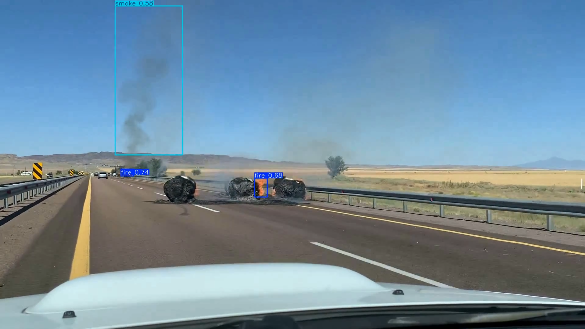

# 🔥 Fire & Smoke Detection Training & Deployment Pipeline

[](https://www.python.org/)
[](https://pytorch.org/)
[](https://github.com/ultralytics/ultralytics)
[](#-license)

An end-to-end dataset engineering, quality assurance, training, evaluation, and deployment framework for **Fire & Smoke Detection using YOLOv26**.

This repository provides a complete workflow for transforming raw datasets into deployment-ready fire and smoke detection models through automated dataset preparation, semantic deduplication, model training, benchmarking, and hardware-optimized deployment.

> [!NOTE]
> This repository does **not** include datasets or trained weights.
> Users are expected to prepare their own datasets and train models using the provided pipeline. Refer to the documentation under `docs/` for the complete workflow.

---
## Sample Video Demonstration
 
[](output/merged_output.mp4)
[Watch video (MP4)](output/merged_output.mp4)

---output
## 🎯 Repository Philosophy

Most computer vision repositories focus primarily on model training. This repository emphasizes the complete machine learning lifecycle:

1. Dataset Quality
2. Dataset Diversity
3. Reproducible Experiments
4. Deployment Readiness

The goal is to help users build robust fire and smoke detection systems using their own datasets rather than relying on pre-packaged data.

---

## 🚀 Core Features

### 📊 Dataset Engineering & Quality Assurance

* Dataset standardization and class remapping
* Automated YAML generation
* Background image support
* Annotation validation and visualization
* Corruption detection and removal
* Extreme aspect ratio filtering
* Tiny object filtering
* Background balancing

**Semantic Deduplication**
Near-duplicate image removal powered by DINOv2 feature extraction, FAISS similarity search, and HNSW indexing. This significantly improves dataset diversity while reducing training redundancy.

### 🏋️ Model Training

* YOLOv26 training pipeline
* Automatic CPU / GPU detection (Single-GPU and Multi-GPU support)
* Resume training support
* Deterministic experiment execution
* Domain-specific augmentation strategies
* Automated dataset integrity verification

### 📈 Evaluation & Benchmarking

* mAP@50 and mAP@50-95
* Precision & Recall
* CPU & GPU latency benchmarking
* FPS measurement
* Cross-dataset evaluation support

### 📦 Deployment

* PyTorch deployment, ONNX export, and TensorRT export
* Standard video inference
* Quadrant split-frame inference
* Production deployment validation

**Split-Frame Inference:** A specialized deployment mode that divides frames into a `2×2` grid before inference and merges the results afterward. This yields improved small smoke detection, better distant-object detection, and higher effective inference resolution.

---

## 🤖 Supported Models

| Model | Purpose |
| --- | --- |
| **YOLOv26n** | Lightweight deployment and faster inference |
| **YOLOv26s** | Higher accuracy deployment |

*Additional YOLOv26 variants can be integrated through the training pipeline.*

---

## 🚀 Getting Started

### Prerequisites

* **Python:** 3.9+
* **Hardware:** GPU with CUDA support and the latest drivers installed
* **Knowledge:** Basic understanding of Exploratory Data Analysis (EDA)
* **Data:** Your dataset must follow the standard YOLO annotation format

---

### 1. Clone Repository

```bash
git clone http://10.10.30.65:3000/trainee-ai-ml/fire-smoke-training-pipeline.git
cd fire-smoke-training-pipeline

```

### 2. Create Virtual Environment

**Linux / macOS**

```bash
python3 -m venv venv
source venv/bin/activate

```

**Windows (PowerShell)**

```powershell
python -m venv venv
venv\Scripts\Activate.ps1

```

### 3. Install Dependencies

```bash
pip install tensorrt
pip install torch torchvision torchaudio --index-url https://download.pytorch.org/whl/cu121
pip install -r requirements.txt

```

> **Note:** Install cuda compiled torch, torchvision and torchaudio based on your cuda version only.

---

## ⚡ Quick Start (5 Minutes)

Run the entire pipeline with a single command using the YAML-based orchestrator:

```bash
# Run the complete pipeline: standardize → clean → deduplicate → train → benchmark → export → inference
python pipeline.py -c pipeline.yaml
```

No need to run individual scripts sequentially. The orchestrator handles everything! 🚀

---

## 🔄 Pipeline Orchestrator

The `pipeline.py` script provides a **unified YAML-driven interface** to execute the entire fire & smoke detection workflow without manual script chaining.

### Why Use the Orchestrator?

✅ **Single Command Execution** – Run the entire pipeline in one go  
✅ **Flexible Stage Selection** – Enable/disable any stage in `pipeline.yaml`  
✅ **Automatic Path Management** – Handles inter-stage dependencies seamlessly  
✅ **Reproducible Experiments** – Version-control your entire config  
✅ **Production Ready** – Used for all automated training runs  

### Configuration: `pipeline.yaml`

The `pipeline.yaml` file controls which stages to run and their parameters:

```yaml
pipeline:
  stages:
    - standardize    # Optional: Standardize dataset and class labels
    - clean          # Optional: Remove corrupted/invalid files
    - deduplicate    # Optional: Remove semantic duplicates (DINOv2 + FAISS)
    - eda            # Optional: Generate dataset statistics and visualizations
    - train          # Required: Train YOLOv26 model
    - benchmark      # Optional: Benchmark inference latency & FPS
    - export         # Optional: Export to ONNX & TensorRT
    - inference      # Optional: Run inference on video/images

dataset:
  dir: "datasets/sample-dataset/"        # Dataset directory path
  classes: ["fire", "smoke"]              # Class labels
  dedup_threshold: 0.985                  # Similarity threshold for deduplication (0-1)
  dedup_batch_size: 64                    # Batch size for FAISS deduplication

training:
  data_yaml: "datasets/sample-dataset/data.yaml"
  weights: "weights/yolov26n/yolo26n.pt"  # Pre-trained weights (nano)
  results_dir: "results/"
  name: "FS-Pipeline-Run"                 # Experiment name
  epochs: 100
  patience: 20                            # Early stopping patience
  imgsz: 640                              # Input image size
  batch_size: 64                          # Batch size
  workers: 8                              # Data loading workers
  device: "auto"                          # auto / 0 / "0,1,2,3" for multi-GPU
  debug: true                             # Set to true for 2-epoch test runs

benchmark:
  warmup: 10                              # Warmup iterations
  runs: 100                               # Number of benchmark runs

export:
  formats: ["onnx", "tensorrt"]           # Export formats
  half: true                              # Use FP16 quantization
  int8: false                             # Use INT8 quantization
  dynamic: false                          # Use dynamic input shapes
  opset: 17                               # ONNX opset version
  device: "0"                             # Device for export

inference:
  source: "videos/test.mp4"               # Video or image path
  conf: 0.5                               # Confidence threshold
  split_frame: false                      # Enable quadrant split-frame mode
```

### Usage Examples

**Example 1: Full Pipeline (Default)**
```bash
python pipeline.py -c pipeline.yaml
```

**Example 2: Dataset Prep Only**  
Edit `pipeline.yaml` to keep only `standardize`, `clean`, `deduplicate`, `eda` stages, then run:
```bash
python pipeline.py -c pipeline.yaml
```

**Example 3: Training & Evaluation Only**  
Edit `pipeline.yaml` to keep `train`, `benchmark`, `export` stages, then run:
```bash
python pipeline.py -c pipeline.yaml
```

**Example 4: Use Custom Config**
```bash
python pipeline.py -c configs/custom-pipeline.yaml
```

### Stage Reference

| Stage | Purpose | Input | Output | Optional? |
|-------|---------|-------|--------|----------|
| `standardize` | Class remapping & YAML generation | Raw YOLO dataset | Standardized labels | ✓ |
| `clean` | Remove corrupted/invalid images | Dataset | Clean dataset | ✓ |
| `deduplicate` | Semantic duplicate removal (DINOv2) | Dataset | Deduplicated dataset | ✓ |
| `eda` | Dataset statistics & visualizations | Dataset | Analysis report | ✓ |
| `train` | YOLOv26 model training | Dataset + weights | Trained model | ✗ |
| `benchmark` | Latency & FPS benchmarking | Trained model | Benchmark report | ✓ |
| `export` | ONNX & TensorRT export | Trained model | Exported models | ✓ |
| `inference` | Video/image inference | Exported model | Detection results | ✓ |

### Troubleshooting

**Issue:** `FileNotFoundError: [Errno 2] No such file or directory`  
**Solution:** Verify all paths in `pipeline.yaml` are relative to the repository root and use forward slashes `/`.

**Issue:** Pipeline stops at `standardize` stage  
**Solution:** The orchestrator prompts for confirmation on destructive operations (clean, standardize). The script automatically pipes `YES` — if it fails, run individual scripts manually.

**Issue:** CUDA out of memory during training  
**Solution:** Reduce `batch_size` in `pipeline.yaml` or set `device: "auto"` to allow automatic device selection.

For more details, see [docs/pipeline.md](docs/pipeline.md) or run with individual scripts:
```bash
python scripts/training/train.py --help
python scripts/dataset/standardize.py --help
```

---

## 📚 Documentation

| Guide | Description |
| --- | --- |
| [pipeline.md](docs/pipeline.md) | Detailed pipeline orchestrator configuration & schema |
| [architecture.md](docs/architecture.md) | System architecture and data flow |
| [dataset-preparation.md](docs/dataset-preparation.md) | Dataset engineering and validation |
| [training-guide.md](docs/training-guide.md) | Training workflow and hyperparameters |
| [evaluation-guide.md](docs/evaluation-guide.md) | Performance analysis and benchmarking |
| [deployment-guide.md](docs/deployment-guide.md) | Export and deployment workflows |
| [troubleshooting.md](docs/troubleshooting.md) | FAQ and issue resolution |

---

## 🛠️ Detailed Workflow (Manual Execution)

> [!TIP]
> For most users, use the **Pipeline Orchestrator** (`python pipeline.py -c pipeline.yaml`) above.  
> Use this section if you need fine-grained control or want to run individual stages manually.
>
> Run any script with the `-h` or `--help` argument to view a complete list of available features and parameters.

### Step 1 — Dataset Preparation

📖 **Documentation:** [docs/dataset-preparation.md](docs/dataset-preparation.md)

Prepare, standardize, clean, and validate your dataset.

```bash
python scripts/dataset/standardize.py --dataset-dir ./datasets/sample-dataset/

python scripts/dataset/cleaner.py --dataset-dir ./datasets/sample-dataset/

python scripts/dataset/deduplication.py --dataset-dir ./datasets/sample-dataset/ --threshold 0.9 --batch-size 64

```

Before proceeding to training, verify your dataset quality and class distributions:

```bash
python scripts/dataset/eda_stats.py --dataset-dir ./datasets/sample-dataset/

```

### Step 2 — Train Model

📖 **Documentation:** [docs/training-guide.md](docs/training-guide.md)

```bash
python scripts/training/train.py --weights ./weights/yolov26n/yolov26n.pt --data ./datasets/sample-dataset/data.yaml --imgsz 640 --epochs 100 --device 0 --results-dir ./results --name YOLOv26n-v1 --debug
```

### Step 3 — Evaluate Performance

📖 **Documentation:** [docs/evaluation-guide.md](docs/evaluation-guide.md)

> [!IMPORTANT]
> Before running this script, ensure the paths defined in your `data.yaml` correctly match the location of your finalized dataset.

```bash
python scripts/evaluation/benchmark.py --trained-weights .\results\FS-YOLOv26n-v1\weights\best.pt --data datasets\sample-dataset\data.yaml

```

### Step 4 — Export Deployment Artifacts

📖 **Documentation:** [docs/deployment-guide.md](docs/deployment-guide.md)

```bash
python scripts/deployment/export.py --trained-weights results/yolov26n/best.pt --formats onnx tensorrt --imgsz 640 --half --device 0
```

### Step 5 — Run Inference

📖 **Documentation:** [docs/deployment-guide.md](docs/deployment-guide.md)

**Standard Inference**

```bash
python scripts/evaluation/inference.py --weights models/yolov26n/best.engine --source test.mp4 --results-dir result/

```

**Split-Frame Inference**

```bash
python scripts/evaluation/inference.py --weights models/yolov26n/best.engine --source test.mp4 --results-dir result/ --split-frame

```

---

## 🏗️ Pipeline Overview

```text
Raw Dataset
      │
      ▼
Standardization ──► Cleaning ──► Semantic Deduplication ──► Dataset Validation
                                                                  │
                                                                  ▼
Inference ◄── Export ◄── Benchmarking ◄── Training ◄──────────────┘

```

---

## 📂 Repository Structure

```text
fire-smoke-training-pipeline/
├── docs/
│   ├── architecture.md
│   ├── dataset-preparation.md
│   ├── training-guide.md
│   ├── evaluation-guide.md
│   ├── deployment-guide.md
│   └── troubleshooting.md
├── scripts/
│   ├── dataset/
│   ├── training/
│   ├── evaluation/
│   └── deployment/
├── models/
├── logs/
├── results/
├── requirements.txt
└── README.md

```

---

## 📋 Best Practices

* **Prioritize recall** for fire-safety applications to minimize missed detections.
* **Validate annotations** visually before initiating large-scale training.
* **Remove semantic duplicates** to ensure the model learns diverse features rather than memorizing redundant frames.
* **Benchmark** every exported model to ensure latency requirements are met.
* **Archive** experiment logs and benchmark reports for traceability.
* **Build TensorRT engines natively** on the exact target hardware to avoid compatibility issues.

---

## 📈 Results

Benchmark results and deployment metrics should be recorded and versioned for each experiment. Example directory structure:

```text
results/
├── FS-YOLOv26n-v1/
├── FS-YOLOv26n-v2/
├── FS-YOLOv26s-v1/
└── benchmarks/

```

---

---

## 🤝 Contributing

Contributions are welcome! We're actively seeking improvements in:

* **Dataset Engineering** – New cleaning/deduplication algorithms
* **Model Improvements** – Better training strategies, augmentation techniques
* **Optimization** – Faster benchmarking, improved inference speed
* **Deployment** – Better export formats, hardware support (TPU, NPU)
* **Documentation** – Tutorials, examples, troubleshooting guides
* **CI/CD & Testing** – Automated testing infrastructure, GitHub Actions workflows

### How to Contribute

1. **Fork** the repository
2. **Create a feature branch**: `git checkout -b feature/your-feature`
3. **Follow code style**: Use type hints, add docstrings, follow PEP 8
4. **Test your changes**: Run individual scripts with your modifications
5. **Submit a Pull Request** with a clear description of your changes

For detailed guidelines, see [CONTRIBUTING.md](CONTRIBUTING.md) *(coming soon)*.

---

## 📜 License

This project is licensed under the **MIT License** — see the [LICENCE](LICENCE) file for details.

You are free to use, modify, and distribute this software for commercial and non-commercial purposes, provided you include the original license notice.

---

## 🆘 Support & Issues

Encountered a problem? Here's how to get help:

1. **Check the docs**: Start with [docs/troubleshooting.md](docs/troubleshooting.md) for common issues
2. **Search issues**: Browse existing [GitHub Issues](../../issues) for similar problems
3. **Create an issue**: If your problem is new, open a detailed issue with:
   - Python version (`python --version`)
   - PyTorch version (`python -c "import torch; print(torch.__version__)"`)
   - Error message (full traceback)
   - Reproduction steps

---

## 🙏 Acknowledgements

Built using: **YOLOv26**, **PyTorch**, **Ultralytics**, **DINOv2**, **FAISS**, and **OpenCV**.

---

## 📌 Final Note

High-performing fire and smoke detection systems are built on high-quality datasets. This repository prioritizes dataset quality, reproducible experimentation, and deployment readiness to help teams build reliable, real-world solutions.